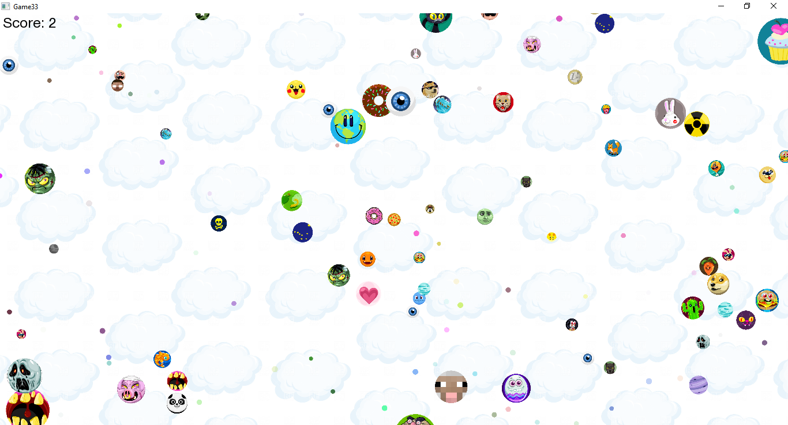
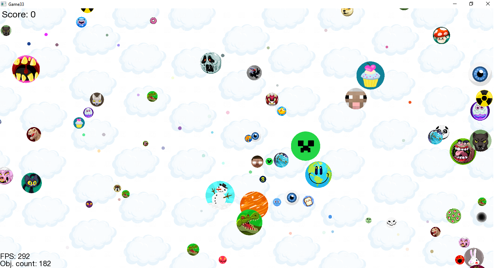
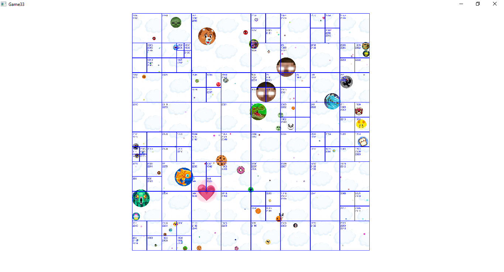
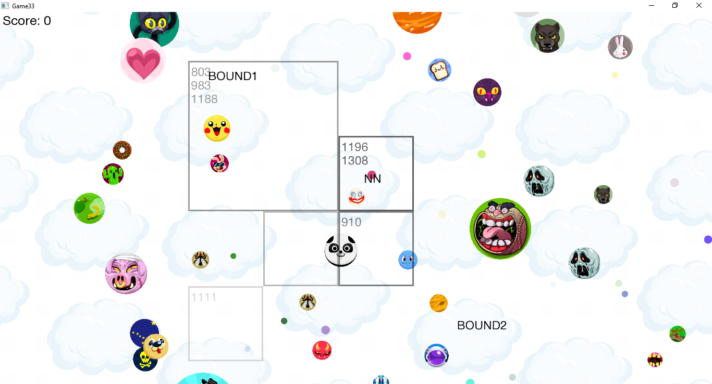

Game-33
=======

This project is a part of home assignment on 2017 C++11 programming course by Mail.Ru.

The game is a simple agar.io clone built with SFML graphics library. The main features are:

- Simple infinite-loop game engine.
- Two types of game objects: passive small colored circles and active enemies that are trying to eat you (or run away from you so that they are not eaten).
- A simple AI of enemies based on nearest neighbor search.
- An implementation of [QuadTree](https://en.wikipedia.org/wiki/Quadtree) data structure to allow fast neighbor search.

The project was compiled under Windows with [GCC 6.1.0 MinGW (SEH) 64-bit](https://sourceforge.net/projects/mingw-w64/files/Toolchains%20targetting%20Win32/Personal%20Builds/mingw-builds/6.1.0/) compiler,  [SMFL 2.4.2](https://www.sfml-dev.org/download/sfml/2.4.2/) and [CodeBlocks](http://www.codeblocks.org/) IDE.

Screenshots:

- Gameplay:

- QuadTree visualization:

